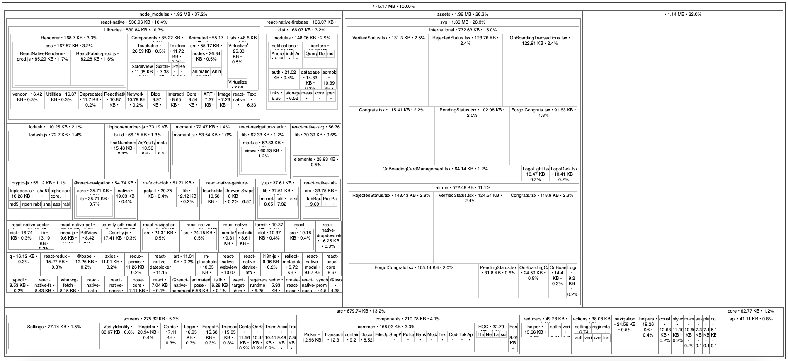

More often you need to understand how much space you can save using this library. The simplest way for performing this - compare files size. But it's a pretty routine task. So you can save a little bit time and get great bundle analytics using such tools as [visualize-bundle](https://github.com/JonnyBurger/npx-visualize-bundle) and [react-native-bundle-visualizer](https://github.com/IjzerenHein/react-native-bundle-visualizer)

## Visualization of the bundle

Since `react-native-bundle-visualizer` has some issues with typescript I recommend you use `visualize-bundle` library.
First of all you need to install it:

```bash
yarn add visualize-bundle -dev
# or with npm
# npm install visualize-bundle --save-dev
```

After installation edit your `package.json`:

```diff
{
  "scripts": {
+      "bundle:analysis": "visualize-bundle"
  }
}
```

And then run analyzer:

- In one terminal:
```bash
react-native start
```

- In the second terminal
```bash
yarn run bundle:analysis
# or with npm
npm run bundle:analysis
```

You will see something like this:



It looks terrible, but let's see a little bit deeply into this picture.

## Analysis of the bundle

First of all you need to look at big rectangles, since they are the most significant. In this picture you can see, that in `node_modules` you have several libraries, with pretty big size, such as `moment`, `lodash`, `react-native-firebase` and others. On other hand we have pretty big `assets` folder and `src` (screens and components).

And here is few tactics for proper splitting the final bundle:

- As an alternative for `moment` you can select any other library that will fit for your goals and require less memory
- For `lodash` you can use not absolute import and import each function as a separate (instead of `import { isEqual } from 'lodash'` you can write `import isEqual from 'lodash/isEqual'`)
- Firebase from `6.0.0` version is not monorepo and for every feature (notification/crashlytics etc) you can use separate package
- All yours code and assets you can wrap in HOC provided by `react-native-bundle-splitter` and it should reduce the size of initial loaded bundle

It's common tactics that you may apply in order to simplify your entry point of an application.

## Summary

The main goal of this article is to demonstrate a way for determining the order and prioritizing thing where you should work. Via visualization of bundle you can understand, what exactly may slow down your startup of an application and understand possible way for resolving it.
